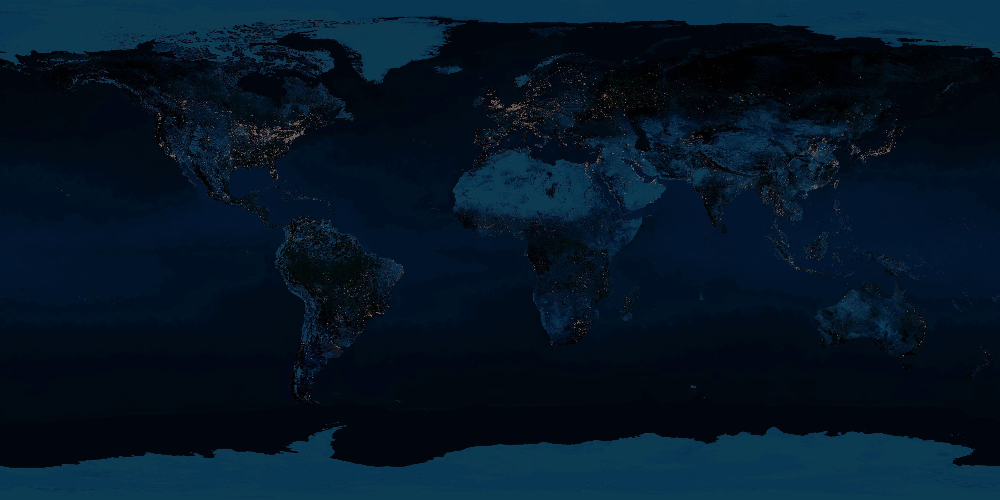

# OrbitalWatch — 3D Space Junk Tracker

A real-time 3D tracker that renders **18,000+ pieces of space junk and active
satellites** orbiting Earth, propagated live from NORAD data with real orbital
physics — from Starlink to decades-old debris clouds.



## Features

- **Live data** — fetches current two-line element sets (TLEs) from
  [CelesTrak](https://celestrak.org), the same catalog NASA's Orbital Debris
  Program Office works from. Falls back to bundled snapshots when CelesTrak is
  rate-limiting or offline.
- **Real physics** — every object is propagated with SGP4 ([satellite.js](https://github.com/shashwatak/satellite-js))
  every frame; Earth rotates on true sidereal time so positions line up with
  geography.
- **Grouped catalogs** — major debris clouds (Cosmos 2251, Iridium 33,
  Fengyun 1C, Cosmos 1408), crewed stations, and the big operators as their own
  color-coded, toggleable layers: Starlink, OneWeb, Iridium NEXT, GPS, GLONASS,
  Galileo, BeiDou, plus the full active catalog.
- **Real-time day/night Earth** — the Sun's position is computed from the clock,
  so the day/night terminator tracks actual UTC and the night side glows with
  city lights (bloom post-processing).
- **3D models** — debris renders as tumbling irregular fragments, intact
  spacecraft as satellite bodies with solar panels — all instanced for
  performance (~100 fps with 18k objects).
- **Time machine** — play/pause, 1× up to 1 hour/second, reverse, jump to now.
- **Inspect anything** — click or search any object for altitude, velocity,
  lat/lon, inclination, period, plus catalog metadata (owner, launch date/site,
  object type, radar size) and a plain-English description. Show its full orbit
  or follow it with the camera.
- **Filters & stats** — toggle catalogs, altitude range, point size; live
  LEO/MEO/GEO counts.

## Run

No build step. ES modules need to be served over `http://` (not opened as a
`file://`), so serve the folder with any static server:

```powershell
python -m http.server 8000
# or: npx serve .
```

Then open **http://localhost:8000**

## Stack

- [three.js](https://threejs.org) — WebGL rendering, instancing, bloom
- [satellite.js](https://github.com/shashwatak/satellite-js) — SGP4/SDP4 propagation
- [CelesTrak](https://celestrak.org) GP API — orbital element sets (no API key required)
- Earth textures: NASA Blue Marble / Black Marble (bundled in `assets/`)

## Data notes

- TLE catalogs are cached in the browser (localStorage, 2-hour TTL) to respect
  CelesTrak's rate limits.
- `data/starlink.tle` is a bundled snapshot used as a fallback; refreshed data
  loads automatically from CelesTrak when available.
- Tracked objects are the public, unclassified catalog — a fraction of the
  estimated 1.2M+ debris objects larger than 1 cm that exist but are too small
  to track individually.
